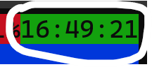
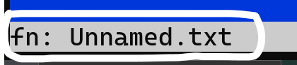
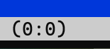
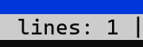

# yedit
usable text editor

## compiling
`make`

## running
run bin/yedit

## The UI

this part of the UI shows you the time<br><br>

this part of the UI shows you the filename/path of the currently open file<br><br>

this part of the UI shows you the position of your cursor<br><br>

this part of the UI shows you how many lines are in the currently opened file<br><br>

## Keys
| Key      | Actions             |
| -------- | --------------------|
| Ctrl + S | Save                |
| Ctrl + W | Save As             |
| Ctrl + O | Open                |
| Ctrl + T | Suspend to terminal |
| Ctrl + Q | Quit                |
| Ctrl + F | Find                |
| Ctrl + E | Run command         |
| Ctrl + K | Cut line            |
| Ctrl + L | Copy line           |
| Ctrl + U | Paste               |
| Ctrl + N | New file            |
| Ctrl + R | Reload              |
| Ctrl + Y | Settings menu       |
| Pg Dn    | Scroll down 4 lines |
| Pg Up    | Scroll up 4 lines   |

## Commands
right now commands are only for debug, but here's a list
| Command              | What it does                      |
| -------------------- | --------------------------------- |
| toggle render null   | renders null terminators as ^@    |

## Config
the default yedit config looks like this: 
```properties
# yedit settings file

# tab size (default: 4)
tabsize = 4
linenumbers = true
# theme (default: retro)
# themes are located in the themes folder
theme = retro
```
tabsize is the amount of spaces used to render a tab<br>
linenumbers is a property that renders the line number before each line on the open file<br>
theme is what theme you can use
### themes
here is what the retro theme config looks like:
```properties
editorBG = blue
editorFG = white
barBG    = white
barFG    = black
timeBG   = green
timeFG   = black
```
BG is background and FG is foreground
#### colours
here is a list of colours:
```
black
red
yellow
green
blue
magenta
cyan
white
grey
lightred
lightgreen
lightyellow
lightblue
lightmagenta
lightcyan
lightwhite
```
