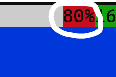

# yedit
that's right! i'm rewriting yedit again! (i've done this 14 times now i don't know when to stop)

## compiling
`make`

## running
run bin/yedit

# The UI

this part of the UI shows you the time  

this part of the UI shows you the percentage of your memory used  

this part of the UI shows you the filename/path of the currently open file  
